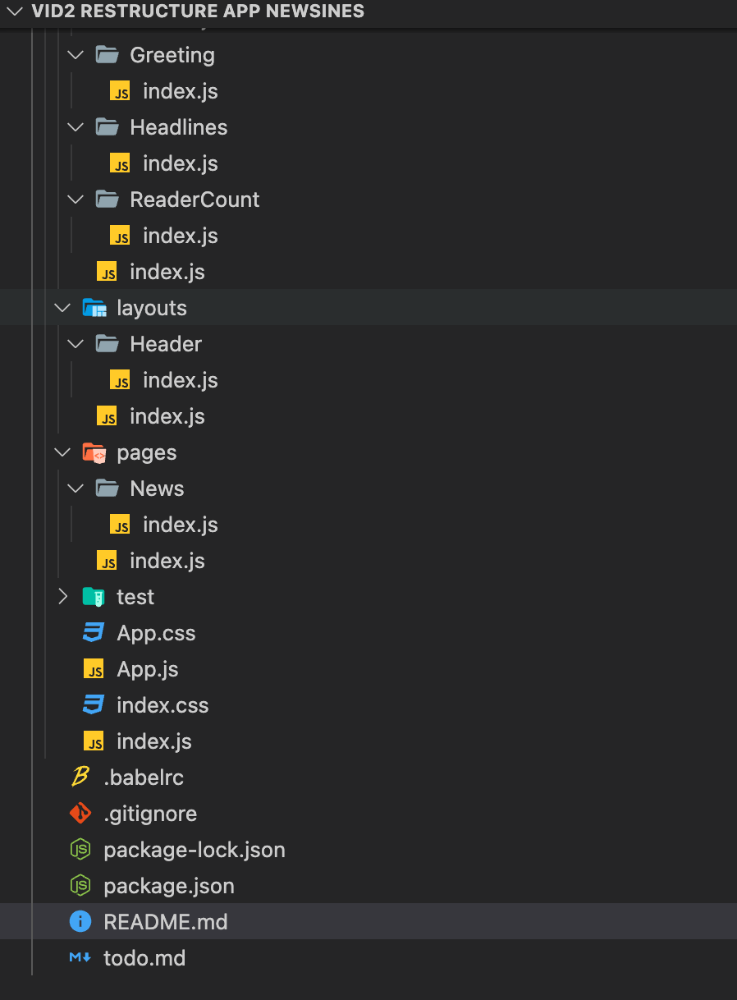

# LAP 3 Practice Newsines 

Practice to restructure the App.js into a few components

- clone repo -> cd into filder -> `npm install` -> `npm test ` (to check tests)
- Goals was to put everything into small folders (break int small pieces )

Structure: 
Folders:
- components/
- layout/
- pages/
- tests/

